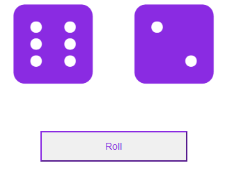

# Dice Play!

## Description

This is simple app created with React presents two dice and lets you click a button for them to be thrown and the result of this will be shown.

## How to run it:

In the project directory, run:

### `npm start`

After a few minutes, this should automatically open the app in your browser or, if not, try opening it by yourself going to [http://localhost:3000](http://localhost:3000).
